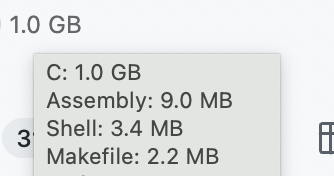
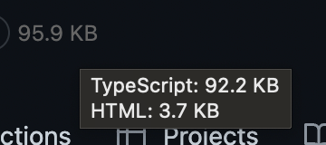

# Repo Code Size

A chrome extension to show how many codes are in a repository, and understand what a massive thing the hard-working authors are maintaining.

## Feature

Show the size of codes in a repository besides the repository title.

Hover to see the size of each type of codes.

## Installation

1. Go to [Releases](https://github.com/JacobLinCool/repo-code-size/releases).
2. Download the latest `extension.zip` file.
3. Unzip the file, you should see a folder named `extension`.
4. Go to [`chrome://extensions/`](chrome://extensions/), enable `Developer Mode`.
5. Click on `Load unpacked extension...` and select the `extension` folder.
6. Done! Try to reload a repository page and see the effect.
